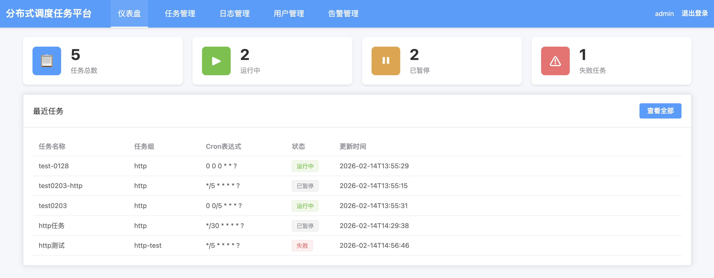
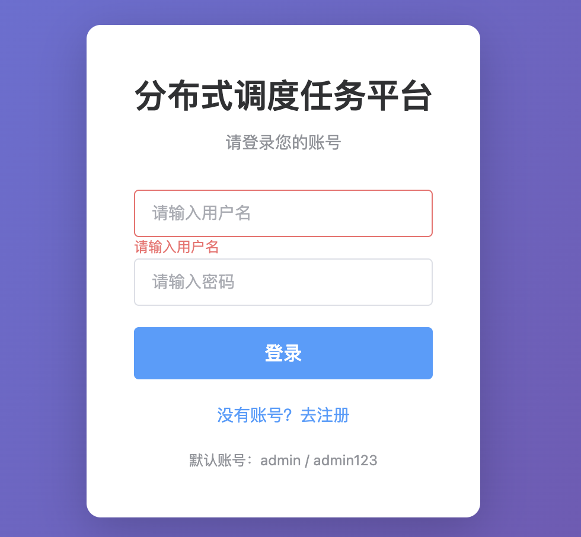
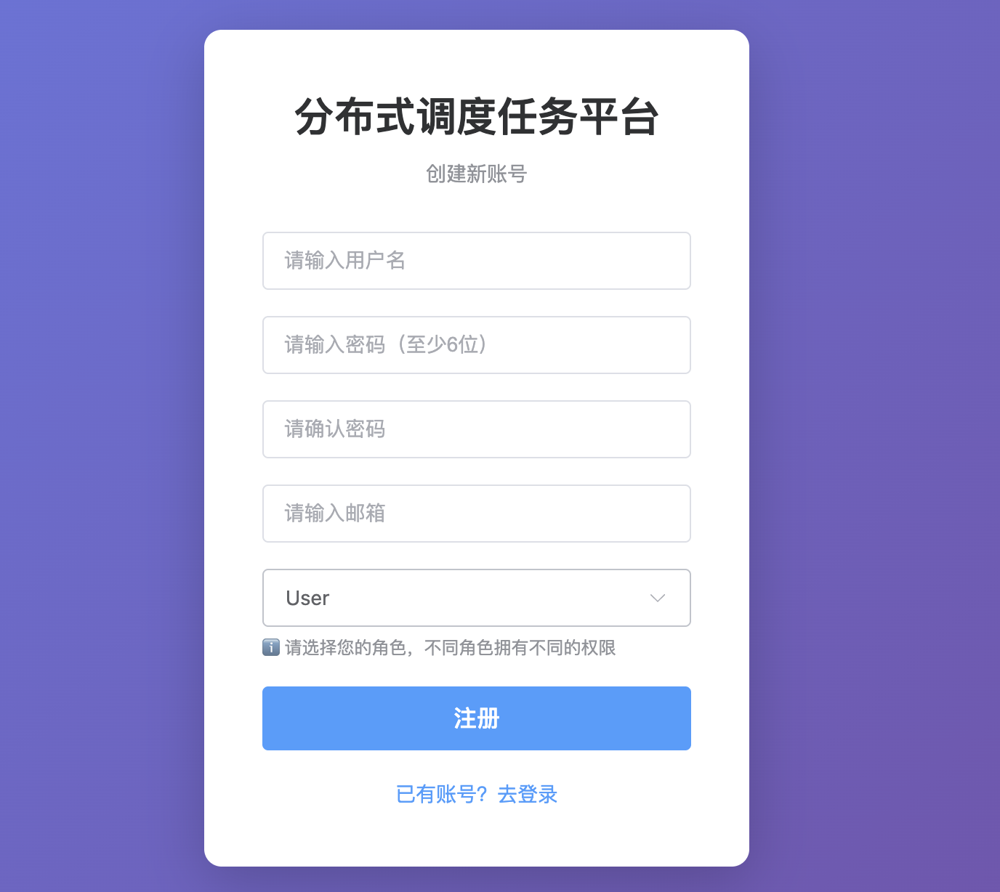
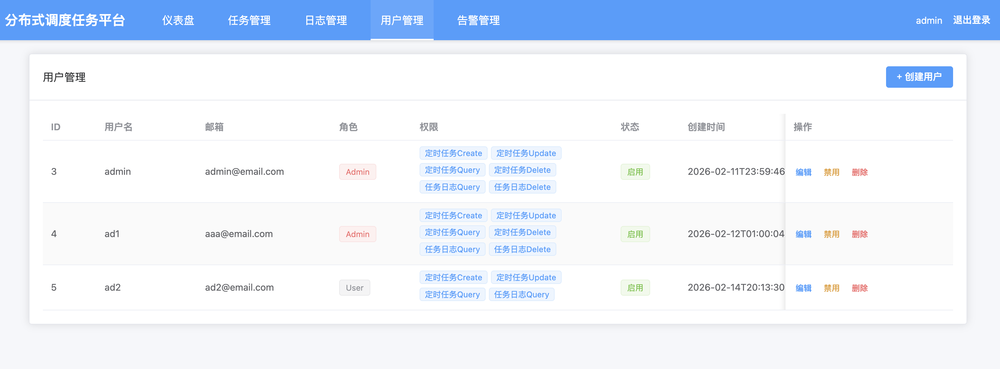
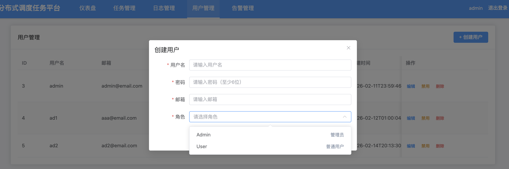
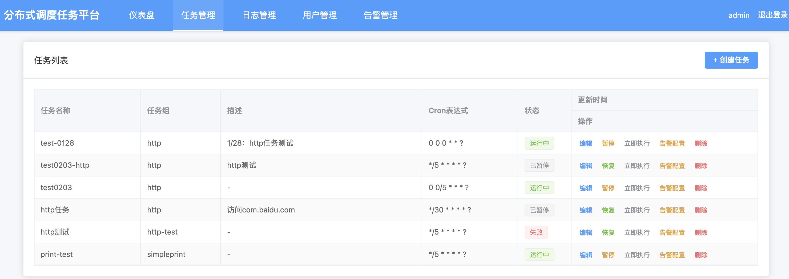
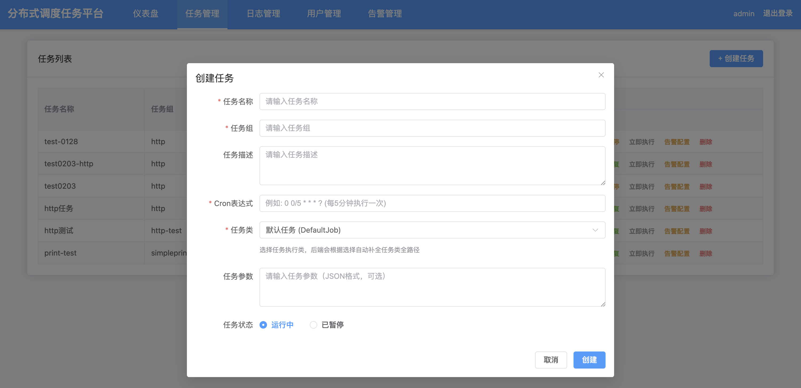
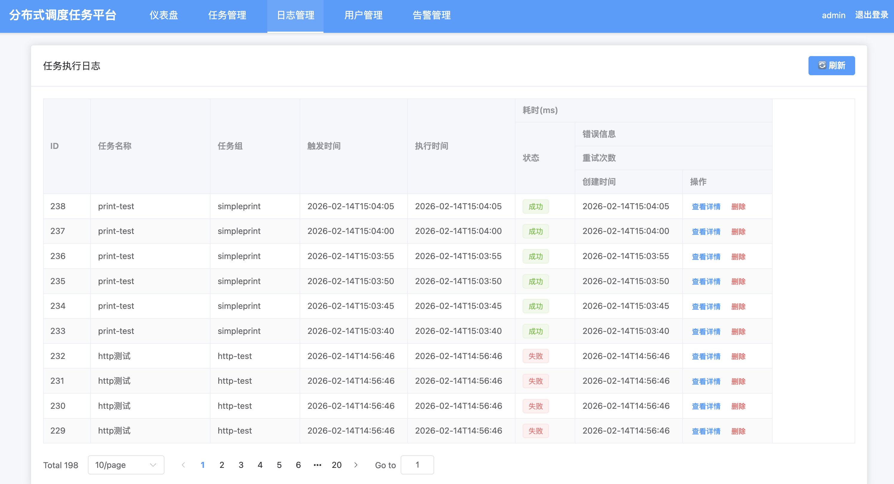
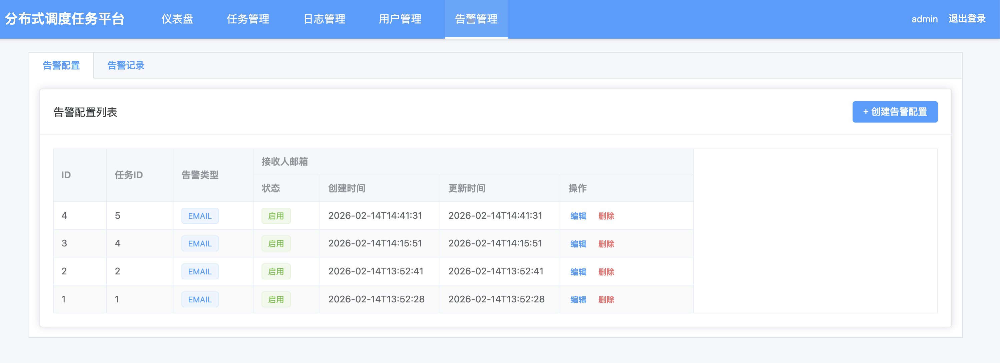
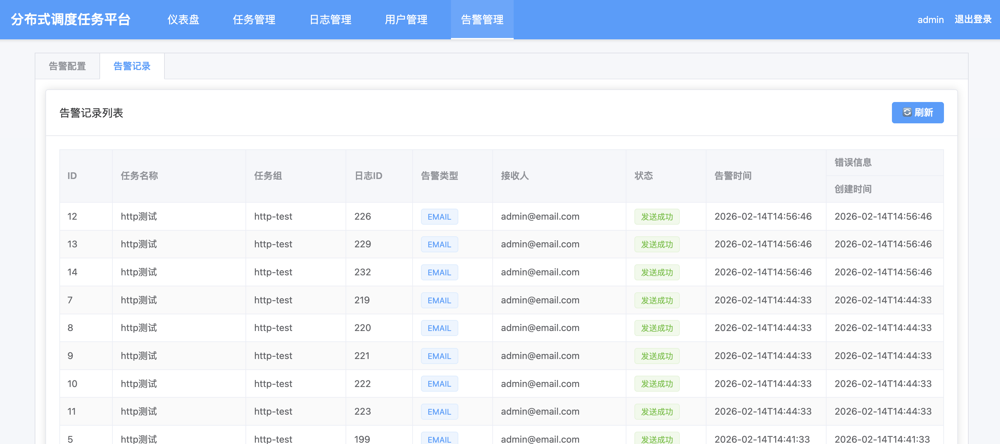

# ScheduleJob
基于 Spring Boot 的分布式任务调度平台，采用 Quartz 作为核心调度引擎，Redis 实现分布式协调.<br>

任务管理
- 任务CRUD：支持创建、编辑、删除、查询任务（字段：任务名称、执行器、Cron表达式、描述、状态（启用/禁用））
- 执行器管理：注册/维护执行器（应用名称、地址列表、状态），支持自动发现
- 任务触发：手动触发执行 + Cron定时触发（支持常见Cron表达式解析、校验）

执行控制
- 失败重试：可配置重试次数（0-3次）、重试间隔（1-5分钟）
- 任务状态：运行中、已完成、失败、暂停（清晰展示）
- 并发控制：基于Redis分布式锁，避免同一任务重复执行 

日志追溯
- 执行日志记录：包含任务ID、执行时间、耗时、执行结果（成功/失败）、异常堆栈（失败时）
- 日志查询：按任务名称、时间范围、执行状态筛选查询
- 日志导出：支持导出近7天执行日志（CSV格式）

基础告警
- 失败告警：任务执行失败后，通过邮件通知指定接收人（配置收件人邮箱）
- 告警记录：记录告警时间、任务ID、告警方式、接收人

系统基础功能
- 用户登录：简单账号密码登录（默认管理员账号，支持修改密码）
- 权限控制：基础角色（管理员/普通用户），普通用户仅可查看/触发任务，管理员全权限

## 项目预览
### 功能1：定时任务可视化


### 功能2：权限控制流程





### 功能3: 定时任务CRUD



### 功能4: 日志管理


### 功能5: 基础告警功能



## Release 2026.2.14 功能说明
**完成权限控制和告警功能实现**

一、权限控制 <br>
目标：保证安全性<br>
分为两类：<br>
a. 基于角色的访问控制(RBAC)：谁(User)拥有什么样的角色(Role)拥有哪些权限(Permission)<br>
b. 基于属性的访问控制(ABAC)：该模型常见于分布式云系统中，属性可扩展为资源/机器/Region，即以物的属性做权限区分，而不是单指基于人的属性（角色）区分控制权限，ABAC是RBAC模型的扩展。<br>
数据库表设计 <br>
五张表：用户表User，角色表Role，权限表Permission，用户角色关系表User-Role，角色权限关系表RolePermission表，符合数据库设计的单一原则。<br>
数据库表设计思路：<br>
（1）sys_job_user、sys_job_role和sys_job_permission表中都使用了id作为主键，但是唯一约束是不用的，<br>
确定唯一约束的核心逻辑是： 识别业务上 天然不允许重复的标识信息。<br>
例如sys_job_user中username用户名（登录标识）必须唯一，sys_job_role中角色编号必须唯一、sys_job_permission中权限编号必须唯一<br>
（2）sys_job_user_role和sys_job_role_permission表使用InnoDB存储引擎的B树做联合索引<br>
（3）sys_job_alert_config和sys_job_alert_record表中，索引可以有多个。索引设计的核心是匹配查询频率和场景，在告警记录中可以通过任务id检索、也可以用任务执行日志id检索。<br>
（4）sys_job_permission和sys_job_role_permission使用inner join内连接，实现连表查询。<br>
内连接/左连接/右连接语法：selete table1.* from table1 inner/left/right join table2 on table1.id = table2.id where id = ?<br>
二、认证功能<br>
1、加密算法：BCrypt基于 Blowfish 加密算法改造的自适应哈希算法，生成加密后密码：先生成salt再hash。<br>
在选择jar的时候，考虑到springboot-security说存在CVE安全问题，本项目使用的是org.mindrot.bcrypt.<br>
相关链接：https://www.herodevs.com/vulnerability-directory/cve-2025-22234
2、token认证：TokenHandlerInterceptor实现springboot HandlerInterceptor接口，重写preHandler()。<br>
在 Spring MVC 中，Handler 指处理 HTTP 请求的处理器，通常是 Controller 方法。因此Handler = Controller 方法（处理请求的业务逻辑），HandlerInterceptor = 拦截 HTTP 请求的拦截器（框架层面）。<br>
命名原则：实现什么接口，就叫什么名字。<br>
在本项目中Token验证拦截器命名为；TokenHandlerInterceptor<br>
重写preHandler()：在进行基础校验后，查询sys_job_user_session表判断当前token是否过期，确保用户登录会话的有效性。<br>
【核心思路】在本项目认证+鉴权的层次设计中：<br>
Http Request -> TokenHandlerInceptor（实现springboot HandlerInterceptor接口，重写preHandler方法）实现token校验、验证token是否过期、将用户信息存入request -> Controller控制器加上自定义注解@RequirePermission("job:create")，通过解析注解验证用户权限，无权限则退出访问 ->执行业务逻辑<br>
三、授权功能<br>
参考apache shiro 手写AOP实现授权功能，自定义注解 @RequirePermission("job:create")，通过拦截器/过滤器实现权限校验。<br>
（1）自定义注解PointCut/Aspect/Around/Before/After/RequirePermission，实现解析PointCut切点接口PointcutMatcher和PointcutMatcherImpl，<br>
参考官方实现：org.aspectj.weaver.tools下PointcutParser。<br>
核心思路：正则表达式匹配原则，解析PointCut切点注解标柱的：返回值 包名 类名（返回值），将其保存ExecutionPointcutNode切点表达式<br>
（2）将拦截器拦截的方法转换为切面的方法调用。采用工厂模式，使用代理工厂，根据目标类是否有接口决定JDK动态代理/CGLIB动态代理。<br>
其中，InvocationHandler是JDK 动态代理处理器，使用 method.invoke(target, args)（反射调用目标对象）；<br>
而MethodInterceptor是CGLIB 拦截器，使用 methodProxy.invokeSuper(proxy, args)（调用代理对象的父类方法）<br>
参考官方实现：org.springframework.aop.framework下ProxyFactory<br>
JDK和CGLIB动态代理的实现参考官方实现：org.springframework.aop.framework CglibAopProxy<br>
（3）切面扫描和解析：扫面项目文件下的所有被Aspect注解标注的类，解析切点、切点表达式和通知，全部保存到切面实例中，最后将切面实例保存到Spring上下文，交由Spring代管。<br>
（4）通过Spring BeanPostProcessor在Bean初始化后找到切面中被切点表达式标记的bean，该bean为目标方法，通过反射调用时会优先正常的方法先执行目标bean。<br>
（5）创建代理对象，执行切面的鉴权方法AuthService.checkPermission()<br>
（6）鉴权完毕后执行定时任务 CRUD<br>
【业务流程】<br>
1、用户前端请求 → TokenHandlerInterceptor 验证 Token，将 userId 存入 request<br>
2、Controller 方法 → 被 PermissionAspect 拦截<br>
3、权限验证 → 从 request 获取 userId，调用 AuthService.checkPermission() 验证<br>
4、验证通过 → 执行目标方法<br>
5、验证失败 → 抛出 BusinessException，返回无权限错误<br>
四、告警功能<br>
实现任务执行失败时及时通知，新增AlertService.sendAlert(JobLog log)接口，功能点：在任务失败时触发告警、同一任务短时间内多次失败，只发送一次告警<br>

**编码过程总结**

1、编译报错引入注解依赖：<br>
ava: Annotation processing is not supported for module cycles. Please ensure that all modules from cycle [schedule-job-admin,schedule-job-common] are excluded from annotation processing
解决方案：使用Module->Analyze dependencies->Analyze，找到依赖后并解决后，点击Sync Maven Project，重新加载Maven，再编译运行。
参考链接：https://stackoverflow.com/questions/27223917/how-to-configure-annotations-processing-in-intellij-idea-14-for-current-project
2、HttpMediaTypeNotAcceptableException报错：<br>
封装的统一响应体没有get属性，导致spring无法识别正确的响应体体格式<br>
参考链接：https://stackoverflow.com/questions/28466207/could-not-find-acceptable-representation-using-spring-boot-starter-web<br>
3、注册用户时创建角色列表失败：<br>
401 (Unauthorized)，接口被 TokenHandlerInterceptor 拦截，需要 token 验证，但注册页面访问时用户尚未登录，没有 token。<br>
修复：在 WebMvcConfig 中将 /api/login/register/roles 加入拦截器排除列表，使其无需 token 验证。<br>

参考文档：<br>
1、https://www.cnblogs.com/-tang/p/13220418.html
2、https://konnase.github.io/2017/11/25/java_spring/sinosteel-RequiresPermissions%E6%B3%A8%E8%A7%A3%E5%AE%9E%E7%8E%B0%E6%B5%81%E7%A8%8B/
3、shiro官方文档：https://github.com/apache/shiro/blob/main/core/src/main/java/org/apache/shiro/authz/annotation/RequiresPermissions.java

## Release 2026.2.4 功能说明
**修复已知问题**
1. Quartz 通过反射创建实例，无法使用 Spring 依赖注入 JobLogRepository，任务执行时 jobLogRepository 为 null，导致日志无法保存。<br>
   修改方案：创建ApplicationContextHolder.java，延迟初始化，在定时任务执行时execute方法中通过 ApplicationContext 获取Bean-JobLogRepository <br>
2. 由于AbstractBaseRepository.save() 执行 INSERT 后，未获取数据库生成的自增ID并回填到实体。 因此在convertToDomain中jobInfoEntity.getId() 仍为 null，导致后续查询失败。<br>
   修改方案：
   在AbstractBaseRepository.save() 执行 INSERT时，根据主键注解判断两种处理方式：（1）实体存在主键id，那么JdbcUtil.java中增加插入并返回主键id的方法executeInsertAndGetId，<br>
   在PreparedStatement使用 RETURN_GENERATED_KEYS 标志，pstmt执行后能够调用getGeneratedKeys()方法返回主键Id，将主键id设置回实体。（2）实体不存在主键id，使用普通更新方法<br>
3. 修复Redis连接池泄漏问题：1）每次调用tryLock都创建新的 RedissonClient，导致资源浪费和连接泄漏 <br>（2）释放锁时，重复添加锁前缀，根据重复锁前缀找不到对应的锁对象<br>
   总结：redis锁工具类核心只有两个方法：获取锁tryLock和释放锁unlock，根据最长等待时间waitTime和锁持有时间leaseTime加锁，释放锁要有当前持有锁的线程释放<br>
4. 日志查询失败：数据库的 bigint(20) 类型在 JDBC 驱动返回时，部分场景下会被解析为 BigInteger 而非 Long，而 Java 实体类的 duration 字段定义为 Long 类型，<br>
   直接赋值就会出现类型不匹配的错误。修复在保存任务执行日志saveJobLog时，约束执行错误信息长度，避免过长溢出。<br>
   修改为：实现TypeConvertorUtil类型转换工具类，mapResultSetToEntity时根据目标实体的类型转换类型<br>

## Release 2026.1.31 功能说明
**完善任务管理机制，实现日志可追溯和可视化前端页面**
基本功能如下：<br>
1. 修复JDBC连接超时问题：由于Quartz 和业务代码共享同一个连接池，且连接池大小为 10，而 Quartz 调度默认线程池有 10 个线程，容易导致连接耗尽，故为 Quartz 创建独立的连接池
2. 定义任务基类并扩展默认任务、数据处理任务、简单任务、HTTP任务，实现任务重试策略
3. 完善日志功能，能够在任务执行过程中自动记录任务执行情况
4. 实现前端任务可视化，包括定时任务仪表盘、任务CRUD、日志管理等页面

**编码过程总结**
如何为Quartz配置默认线程池？<br>
SchedulerFactoryBean是Quartz定时任务执行时的调度工厂，工厂中支持自定义配置数据源setDataResource()<br>
官方文档：https://docs.oracle.com/en/java/javase/17/docs/api/java.sql/javax/sql/DataSource.html<br>

## Release 2025.12.31 功能说明
**搭建基础架构，实现任务CRUD和定时执行核心流程**

基本功能如下：<br>
1. 封装统一异常处理框架：GobalException和BusinessException<br>
2. JDBC + ORM + 模板方法层
* 底层 JDBC 层：借鉴 HikariCP的连接池； 
* ORM 映射层：Hibernate使用注解的方式@Entity/@Table/@Column的设计，实现注解→SQL的动态生成，动态拼接 CREATE TABLE 语句； 
* 模板方法层AbstractBaseRepository：借鉴 Spring JdbcTemplate，将 CRUD 拆分为通用模板和差异化回调；
3. Redis锁实现：解决高并发下易重复创建任务<br>
4. Quartz任务持久化：复用自定义的JdbcClient连接池<br>
* JobInfo业务持久化CRUD ，供整个系统进行Job的管理（数据面），但是定时任务Quartz无法依赖JobInfo进行调度
* 定时任务的框架持久化，保证调度的可靠性（重启不丢失、状态可追溯、集群不重复）

**编码过程总结**
1. 类型擦除及ParameterizedType
接口的参数使用泛型定义，在接口的实现类时明确参数类型，比如：
```
// 定义泛型父类
class Base<T> {}
// 子类明确指定泛型参数
lass Sub extends Base<String> {}
```
但由于Java底层编译时，编译阶段，编译器会根据泛型约束做类型校验。<br>
运行时：JVM会将声明的参数类型向上转型至其边界类型（定义String编译时转成Object）<br>
因此，使用泛型导致编译器无法感知泛型的实际类型，比如实际类型是String和Integer，运行时都会转成Object，称之为 类型擦除。
```
this.entityClass = (Class<T>)((ParameterizedType)getClass().getGenericSuperclass()).getActualTypeArguments()[0]
```
为什么ParameterizedType可以避免类型擦除的问题？
ParameterizedType是java.lang.reflect包中的接口，核心作用是保存编译时确定的泛型参数化类型，将已明确声明的泛型参数信息以原数据Metedata的方式保存在字节码中。<br>
参考：<br>
https://stackoverflow.com/questions/11067512/java-lang-class-cannot-be-cast-to-java-lang-reflect-parameterizedtype<br>
https://www.baeldung.com/java-generic-type-find-class-runtime<br>
https://developer.jboss.org/docs/DOC-13955<br>
https://forums.oracle.com/ords/apexds/post/getclass-getgenericsuperclass-problem-8618<br>
https://medium.com/egnyte-engineering/getting-runtime-type-information-from-a-generic-class-in-java-d05d6854ba5b<br>

2. 自定义注解：参考Hibernate使用注解的方式，自己重写一个。
- @Target：是声明在哪里使用，{ElementType.FIELD, ElementType.TYPE, ElementType.PARAMETER}
- @Retention：声明什么时候运行。CLASS、RUNTIME和SOURCE这三种。只有当声明为RUNTIME的时候，才能够在运行时刻通过反射API来获取到注解的信息。
- @interface：用来声明一个注解
3. JdbcConfigLoader：封装Spring 原生JDBCTemplate 手动建立JDBC连接。 
两种配置的区别：<br>
- 左边是xml写法，是传统Spring手动bean定义，仅存储配置参数。xml解析器-DOM4J<br>
- 右边是yaml写法，通过SpingBoot自动配置，屏蔽JDBC的实现细节，开箱即用，无需手动创建 Connection<br>
4. Jdbc Client手写简易连接池
底层数据库连接使用 java.sql.DriverManager方法，url/user/pwd来源于读取xml配置
```
Connection conn = DriverManager.getConnection(url, user, pwd); //建立连接
conn.close(); //关闭连接
```
连接池的基本配置：最大线程数Max_Pool、最小活跃线程数Min_Idle、最长等待时间Max_Wait<br>
维护两个变量：活跃线程数AtomicInteger和SQL连接队列Queue <br>
【创建连接】核心思路： <br>
- （1）JdbcClient静态方法初始化时，循环建立最小活跃线程数Min_Idle的SQL连接，把所有SQL连接加入连接对列Queue； <br>
- （2）在外部方法获取SQL连接时，优先从连接队列中出队（从空闲线程池中获取），当前线程池活跃线程数AtomicInteger++； <br>
- （3）连接队列为空时，说明当前建立SQL连接已经达到了最小活跃线程数Min_Idle，建立最大线程数Max_Pool的SQL连接（创建新连接），当前线程池活跃线程数AtomicInteger++； <br>
- （4）活跃线程数AtomicInteger达到最大线程数Max_Pool的连接后，等待1000ms后，从SQL连接队列Queue获取空闲SQL连接，获取后当前线程池活跃线程数AtomicInteger++; <br>

【归还连接】核心思路： <br>
- （1）连接无效或者连接关闭，活跃线程数AtomicInteger--； <br>
- （2）连接有效，把SQL连接插入连接队列Queue中，活跃线程数AtomicInteger--； <br>

5. 模版方法AbstractBaseRepository 实现 CRUD，核心思路：通过自定义注解，通过反射自动获取列名和实体的映射，拼接SQL。